# DESPLIEGUE — Evidencias y respuestas

Este documento tiene todas las evidencias y respuestas de la práctica.

---

## Parte 1 — Evidencias minimas

### Fase 1: Instalacion y configuracion

1) Servicio Nginx activo
- Que demuestra: Nginx esta corriendo dentro del contenedor
- Comando: `docker compose exec web service nginx status`


2) Configuracion cargada
- Que demuestra: El archivo default.conf esta montado en /etc/nginx/conf.d/
- Comando: `docker compose exec web ls -l /etc/nginx/conf.d/`


3) Resolucion de nombres
- Que demuestra: Acceso a la web usando nombre de dominio en vez de IP (lo configure en /etc/hosts)


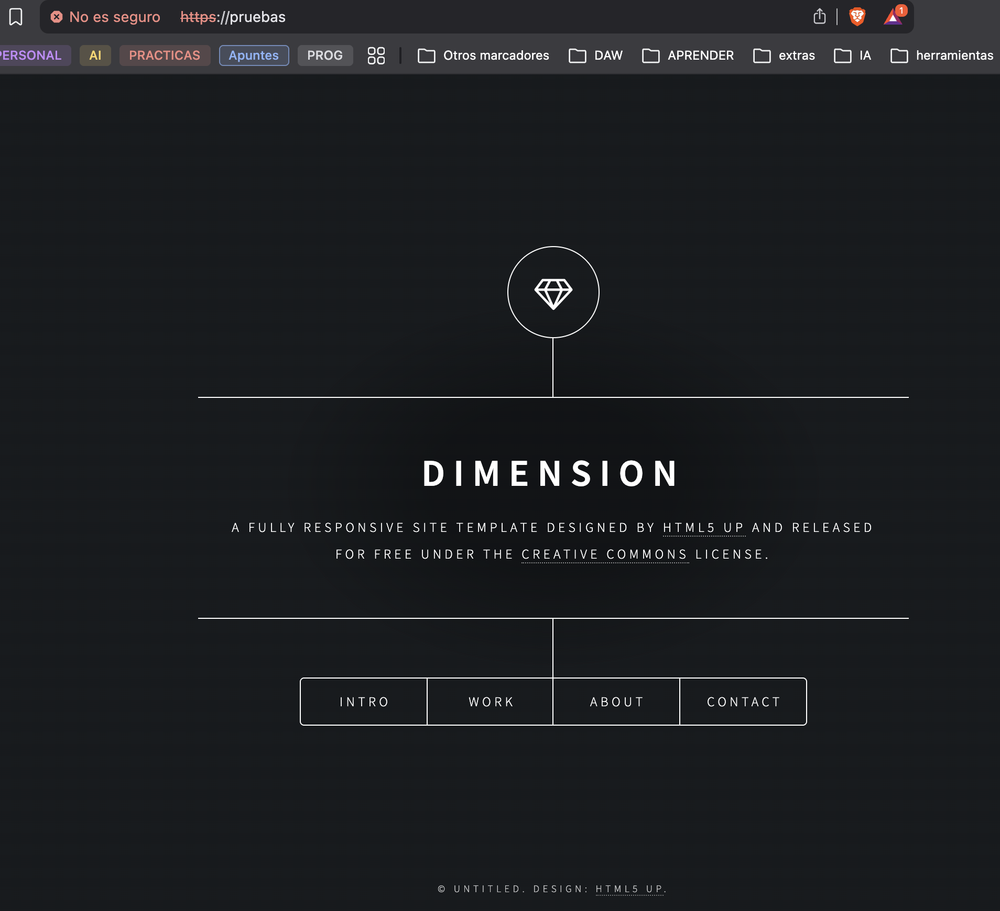

4) Contenido Web
- Que demuestra: La web de Cloud Academy se ve bien


### Fase 2: Transferencia SFTP (Filezilla)

5) Conexion SFTP exitosa
- Que demuestra: FileZilla conecta al servidor SFTP y muestra el directorio /upload
- Datos de conexion: Host=IP local, Puerto=2222, Usuario=soyElAdmin


6) Permisos de escritura
- Que demuestra: Se pueden subir archivos al servidor


### Fase 3: Infraestructura Docker

7) Contenedores activos
- Que demuestra: Los servicios web y sftp estan en estado Up con los puertos mapeados
- Comando: `docker compose ps`


8) Persistencia (Volumen compartido)
- Que demuestra: Lo que subo por SFTP aparece en la web porque comparten el volumen

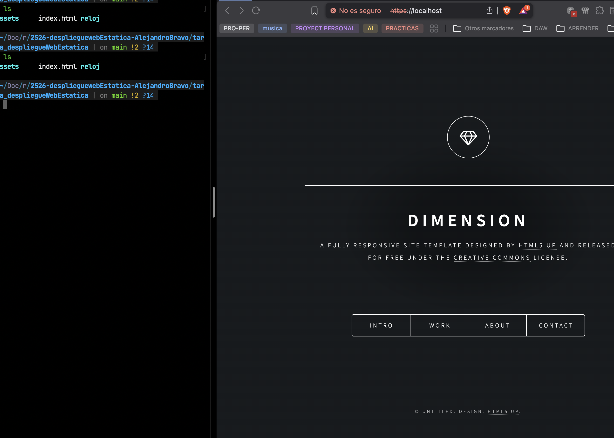
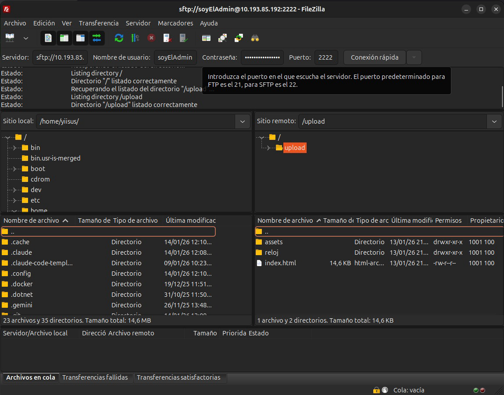

9) Despliegue multi-sitio
- Que demuestra: La web del reloj funciona en /reloj
- URL: http://localhost:8081/reloj


### Fase 4: Seguridad HTTPS

10) Cifrado SSL
- Que demuestra: El navegador accede por HTTPS y sale la alerta del certificado autofirmado
- URL: https://localhost:443


11) Redireccion forzada
- Que demuestra: Al entrar por HTTP devuelve 301 y te manda a HTTPS

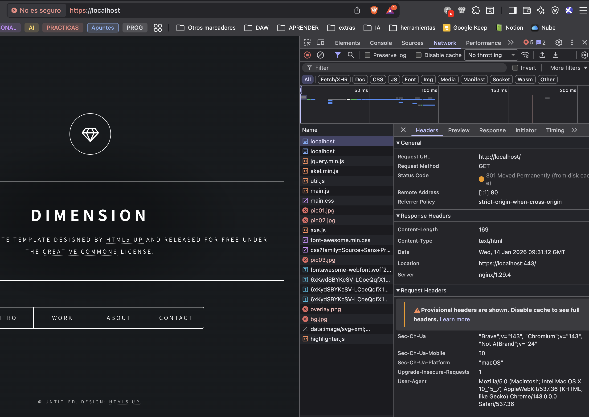

---

## Parte 2 — Evaluacion RA2 (a–j)

### a) Parametros de administracion

Para localizar las directivas ejecuto este comando:
```bash
docker compose exec web sh -c "grep -nE 'worker_processes|worker_connections|access_log|error_log|gzip|include|keepalive_timeout' /etc/nginx/nginx.conf"
```

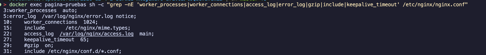

**Explicación de cada directiva:**

- **worker_processes:** Es el numero de procesos que levanta nginx. Normalmente se pone uno por cada nucleo de CPU que tengas.
  - Si pones mal: `worker_processes 200;` en un servidor con 4 nucleos se te va a comer toda la memoria
  - Para comprobarlo: `docker exec pagina-pruebas ps aux | grep nginx`

- **worker_connections:** Las conexiones simultaneas que acepta cada worker
  - Si pones mal: `worker_connections 10;` solo deja 10 usuarios conectados a la vez
  - Para comprobarlo: `docker exec pagina-pruebas nginx -T | grep worker_connections`

- **access_log:** Donde guarda los logs de las peticiones
  - Si pones mal: `access_log /ruta/que/no/existe/access.log;` y nginx no arranca
  - Para comprobarlo: `docker exec pagina-pruebas cat /var/log/nginx/access.log | tail`

- **error_log:** Donde guarda los errores
  - Si pones mal: `error_log /dev/null;` te cargas todos los errores y no te enteras de nada
  - Para comprobarlo: `docker exec pagina-pruebas cat /var/log/nginx/error.log | tail`

- **keepalive_timeout:** Los segundos que mantiene la conexión abierta
  - Si pones mal: `keepalive_timeout 0;` cada peticion tiene que abrir conexion nueva
  - Para comprobarlo: `docker exec pagina-pruebas nginx -T | grep keepalive`

- **include:** Sirve para cargar otros ficheros de configuracion
  - Si pones mal: Que apunte a una carpeta vacia y no carga nada
  - Para comprobarlo: `docker exec pagina-pruebas ls /etc/nginx/conf.d/`

- **gzip:** Comprime las respuestas HTTP para que vayan mas rapido
  - Si pones mal: `gzip_comp_level 9;` y te come mucha CPU
  - Para comprobarlo: `curl -I -H "Accept-Encoding: gzip" http://localhost:8081/`

**Cambio aplicado - keepalive_timeout:**

Primero valido la config:
```bash
docker compose exec web nginx -t
```

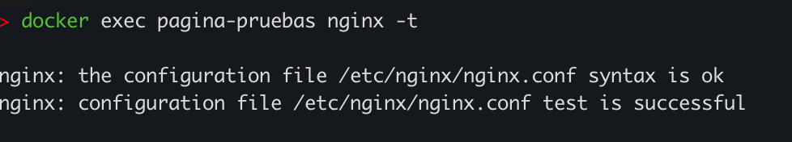

Y despues recargo:
```bash
docker compose exec web nginx -s reload
```

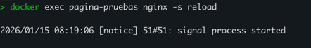

---

### b) Ampliacion de funcionalidad + modulo investigado

**Opcion elegida:** B2 - Cabeceras de seguridad

He añadido estas cabeceras en default.conf:
```nginx
add_header X-Content-Type-Options "nosniff" always;
add_header X-Frame-Options "DENY" always;
add_header Content-Security-Policy "default-src 'self'; script-src 'self' 'unsafe-inline'; style-src 'self' 'unsafe-inline';" always;
```

**Para que sirve cada una:**
- **X-Content-Type-Options: nosniff** - Para que el navegador no intente adivinar el tipo de archivo
- **X-Frame-Options: DENY** - No deja que metan tu pagina en un iframe (evita clickjacking)
- **Content-Security-Policy** - Controla de donde se pueden cargar los recursos

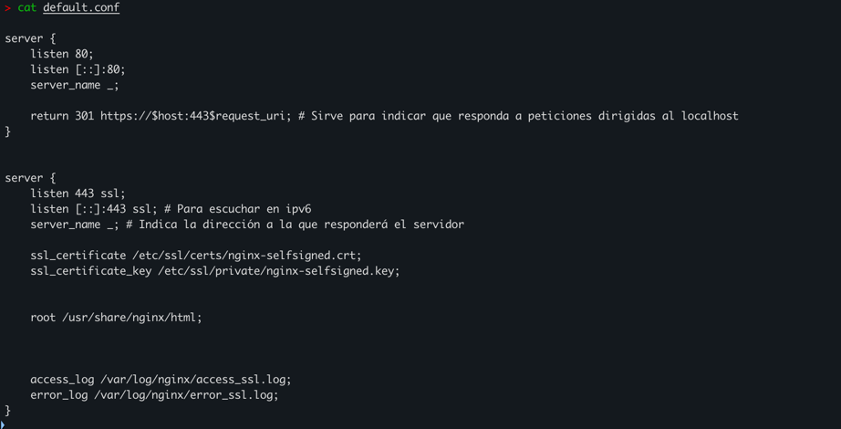

Validacion:
```bash
docker compose exec web nginx -t
```

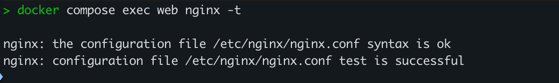

Comprobacion con curl:
```bash
curl -I -k https://localhost:443/
```

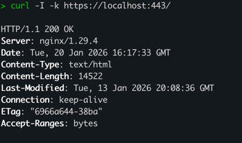

#### Modulo investigado: ngx_http_limit_req_module

Este modulo lo que hace es limitar cuantas peticiones puede hacer un cliente por segundo. Basicamente sirve para protegerte de ataques DDOS o de bots que te hacen muchas peticiones.

Ya viene incluido en nginx asi que solo hay que configurarlo:
```nginx
limit_req_zone $binary_remote_addr zone=limitacion:10m rate=10r/s;
location / {
    limit_req zone=limitacion burst=20 nodelay;
}
```

Fuente: [Documentacion oficial nginx](https://nginx.org/en/docs/http/ngx_http_limit_req_module.html)

---

### c) Sitios virtuales / multi-sitio

Web principal en /:


Web secundaria en /reloj:

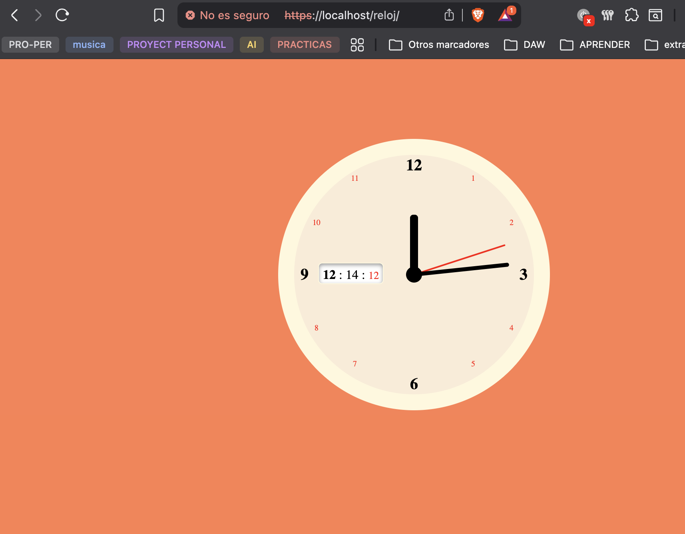

**Diferencia entre multi-sitio por path y por nombre:**

Por path es cuando tienes un solo server_name y usas diferentes location para cada sitio. Por ejemplo `/` y `/reloj` en el mismo server block como tengo yo.

Por nombre es cuando tienes diferentes server_name y nginx decide segun el header Host que manda el navegador. Por ejemplo `web1.com` y `web2.com` en server blocks separados.

**Otros tipos:**
- Por puerto: Cada sitio en un puerto diferente (8080, 8081...)
- Por IP: Cada sitio responde a una IP diferente del servidor
- Por subdominio: blog.midominio.com vs tienda.midominio.com

Config activa en el contenedor:
```bash
docker compose exec web cat /etc/nginx/conf.d/default.conf
```

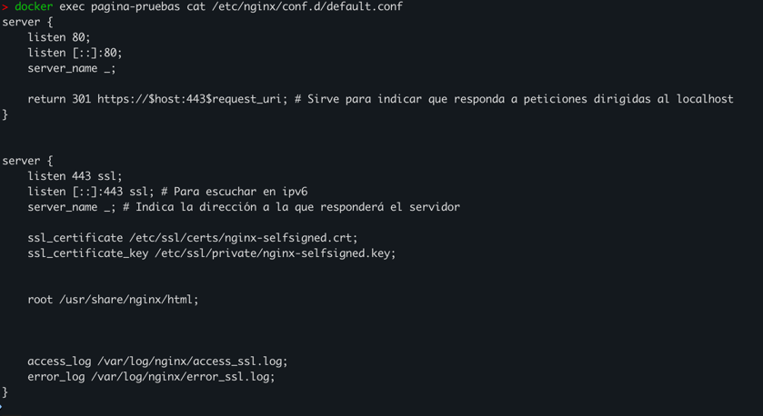

---

### d) Autenticacion y control de acceso

Contenido de admin/index.html:

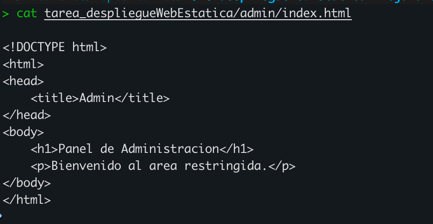

El archivo .htpasswd lo cree con:
```bash
echo "admin:$(openssl passwd -apr1 'Admin1234')" > .htpasswd
```

Configuracion en default.conf:
```nginx
location /admin/ {
    auth_basic "Area restringida";
    auth_basic_user_file /etc/nginx/.htpasswd;
}
```

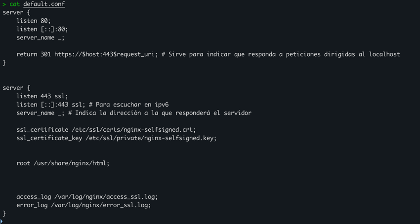

Sin credenciales da 401:
```bash
curl -I -k https://localhost:443/admin/
```

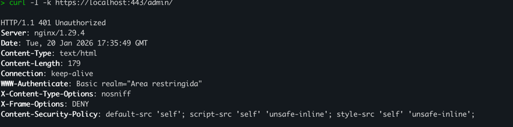

Con credenciales da 200:
```bash
curl -I -k -u admin:Admin1234 https://localhost:443/admin/
```

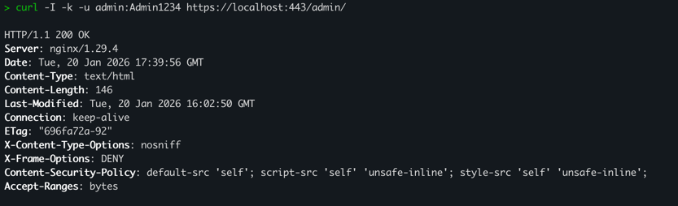

---

### e) Certificados digitales

**Que son .crt y .key:**

El .crt es el certificado, tiene la clave publica y la info del certificado. Este se comparte con los clientes.

El .key es la clave privada, solo la tiene el servidor y nunca se comparte con nadie.

**Por que se usa -nodes:**

Cuando generas el certificado con -nodes la clave privada no tiene contraseña. Esto es para que nginx pueda arrancar solo sin que le tengas que meter la contraseña cada vez. En produccion lo suyo es que tenga contraseña pero para pruebas va bien asi.

Certificados en el host:
```bash
ls -l nginx-selfsigned.crt nginx-selfsigned.key
```

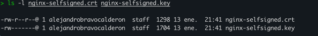

Montaje en docker-compose.yml:

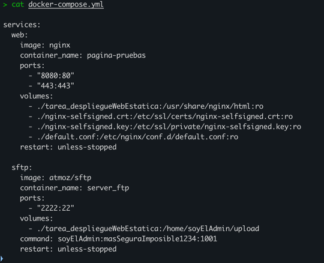

Uso en default.conf:

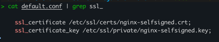

---

### f) Comunicaciones seguras

HTTPS funcionando:

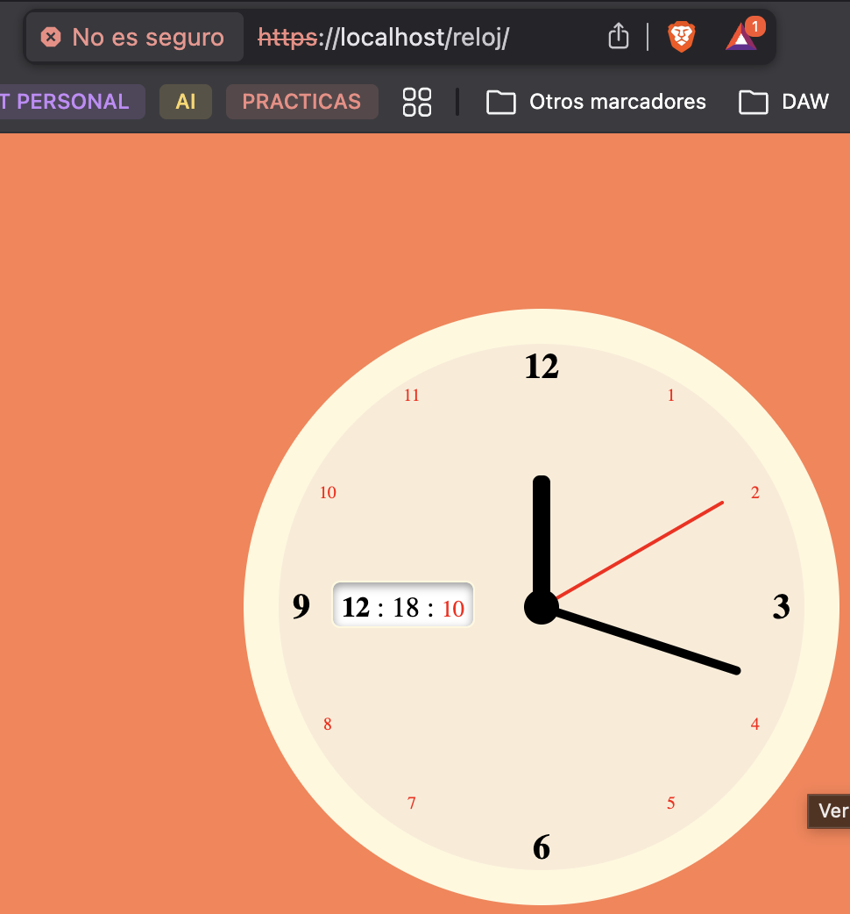

Redireccion HTTP a HTTPS (301):


**Por que uso dos server blocks:**

Tengo uno en el puerto 80 que lo unico que hace es redirigir a HTTPS con un 301. Y otro en el 443 que es el que sirve el contenido con SSL.

Asi me aseguro de que nadie acceda sin cifrar.

---

### g) Documentacion

**Arquitectura:**
- Contenedor web (nginx): Puertos 8081->80, 443->443
- Contenedor sftp: Puerto 2222->22
- Volumen compartido: ./tarea_despliegueWebEstatica

**Configuracion Nginx:**
- Ubicacion: /etc/nginx/conf.d/default.conf
- Server blocks: 2 (uno para HTTP que redirige y otro para HTTPS)
- Root: /usr/share/nginx/html
- Multi-sitio: Por path (/ y /reloj)

**Seguridad:**
- Certificados SSL autofirmados
- Redireccion HTTP->HTTPS (301)
- Cabeceras de seguridad
- Autenticacion basica en /admin

---

### h) Ajustes para implantacion de apps

**Desplegar app en /reloj:**

Los archivos tienen que estar en `/usr/share/nginx/html/reloj/`. El problema es que si la app usa rutas absolutas tipo `/css/style.css` va a buscar en la raiz en vez de en /reloj. Para arreglarlo hay que usar rutas relativas o poner `<base href="/reloj/">` en el HTML.

**Problema tipico de permisos SFTP:**

A veces cuando subes archivos por SFTP quedan con permisos raros y nginx no puede leerlos. Con Docker esto se arregla usando volumenes que sincronizan los permisos automaticamente.


---

### i) Virtualizacion en despliegue

**Instalacion nativa vs contenedores:**

Si instalas nginx de forma nativa (con apt install nginx) tienes que configurar todo a mano, los cambios se quedan en el sistema y si algo se rompe es un lio arreglarlo.

Con contenedores haces docker compose up y ya esta. La configuracion va por volumenes, el contenedor es desechable y funciona igual en cualquier maquina. Si algo falla borras el contenedor y lo vuelves a crear.

La ventaja es que toda la config esta en archivos (docker-compose.yml, default.conf) que puedo subir a Git.

```bash
docker compose ps
```

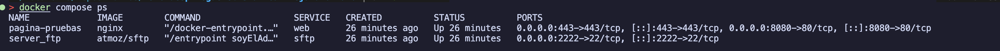

---

### j) Logs: monitorizacion y analisis

Para generar trafico:
```bash
seq 1 20 | xargs -I{} curl -s -k -o /dev/null https://localhost:443/
seq 1 10 | xargs -I{} curl -s -k -o /dev/null https://localhost:443/no-existe-{}
```

Monitorizacion en tiempo real:
```bash
docker compose logs web --tail 50
```

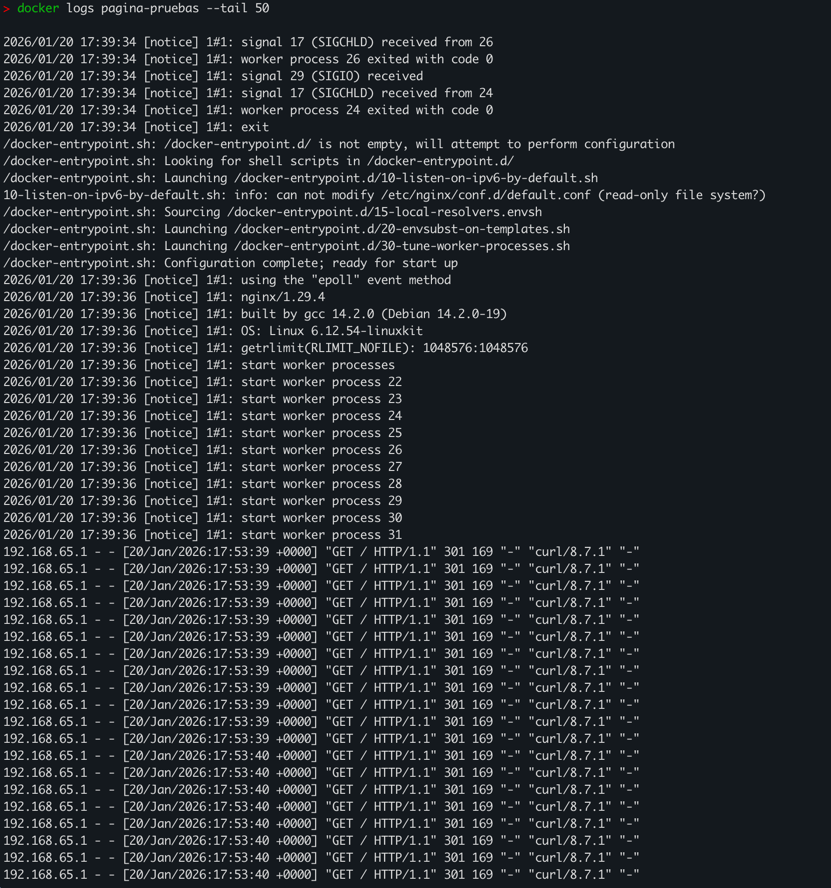

Extraccion de metricas:

URLs mas solicitadas:
```bash
docker compose exec web sh -c "awk '{print \$7}' /var/log/nginx/access_ssl.log | sort | uniq -c | sort -nr | head"
```

Codigos de estado:
```bash
docker compose exec web sh -c "awk '{print \$9}' /var/log/nginx/access_ssl.log | sort | uniq -c | sort -nr | head"
```

Solo los 404:
```bash
docker compose exec web sh -c "awk '\$9==404 {print \$7}' /var/log/nginx/access_ssl.log | sort | uniq -c | sort -nr | head"
```

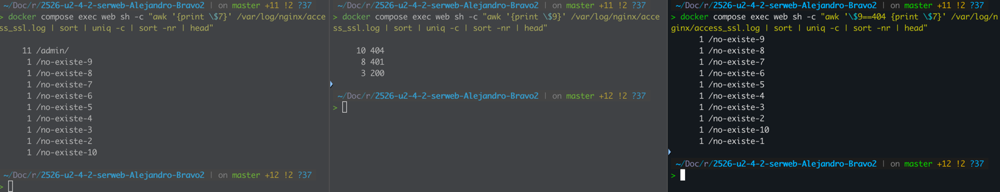

---

## Checklist final

### Parte 1
- [x] 1) Servicio Nginx activo - [evidencia](evidencias/image-10.png)
- [x] 2) Configuracion cargada - [evidencia](evidencias/image-11.png)
- [x] 3) Resolucion de nombres - [evidencia](evidencias/image-13.png)
- [x] 4) Contenido Web (Cloud Academy) - [evidencia](evidencias/image-14.png)
- [x] 5) Conexion SFTP exitosa - [evidencia](evidencias/image-4.png)
- [x] 6) Permisos de escritura - [evidencia](evidencias/image-4.png)
- [x] 7) Contenedores activos - [evidencia](evidencias/image-16.png)
- [x] 8) Persistencia (Volumen compartido) - [evidencia](evidencias/image-19.png)
- [x] 9) Despliegue multi-sitio (/reloj) - [evidencia](evidencias/2026-01-14_12-14-13.png)
- [x] 10) Cifrado SSL - [evidencia](evidencias/image-20.png)
- [x] 11) Redireccion forzada (301) - [evidencia](evidencias/image-21.png)

### Parte 2 (RA2)
- [x] a) Parametros de administracion - [a-01](evidencias/a-01-grep-nginxconf.png), [a-02](evidencias/a-02-nginx-t.png), [a-03](evidencias/a-03-reload.png)
- [x] b) Ampliacion de funcionalidad + modulo investigado - [b2-01](evidencias/b2-01-defaultconf-headers.png), [b2-02](evidencias/b2-02-nginx-t.png), [b2-03](evidencias/b2-03-curl-https-headers.png)
- [x] c) Sitios virtuales / multi-sitio - [c-01](evidencias/c-01-root.png), [c-02](evidencias/c-02-reloj.png), [c-03](evidencias/c-03-defaultconf-inside.png)
- [x] d) Autenticacion y control de acceso - [d-01](evidencias/d-01-admin-html.png), [d-02](evidencias/d-02-defaultconf-auth.png), [d-03](evidencias/d-03-curl-401.png), [d-04](evidencias/d-04-curl-200.png)
- [x] e) Certificados digitales - [e-01](evidencias/e-01-ls-certs.png), [e-02](evidencias/e-02-compose-certs.png), [e-03](evidencias/e-03-defaultconf-ssl.png)
- [x] f) Comunicaciones seguras - [f-01](evidencias/f-01-https.png), [f-02](evidencias/f-02-301-network.png)
- [x] g) Documentacion - Este documento
- [x] h) Ajustes para implantacion - [h-01](evidencias/h-01-root.png), [h-02](evidencias/h-02-reloj.png)
- [x] i) Virtualizacion en despliegue - [i-01](evidencias/i-01-compose-ps.png)
- [x] j) Logs: monitorizacion y analisis - [j-01](evidencias/j-01-logs-follow.png), [j-02](evidencias/j-02-metricas.png)
