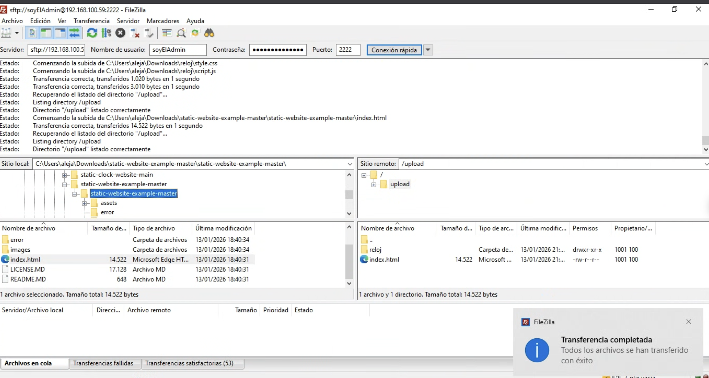
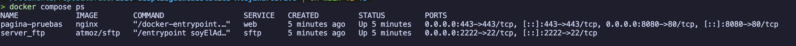
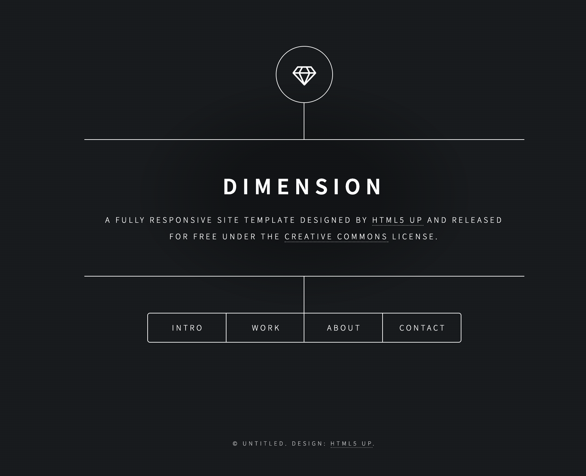

# Práctica: Despliegue de Web Estática con Docker
**Alejandro Bravo Calderón - 2º DAW**

## Índice

1. [Descripción del proyecto](#descripción-del-proyecto)
2. [Estructura del proyecto](#estructura-del-proyecto)
3. [Docker Compose](#docker-compose)
4. [Proceso de despliegue](#proceso-de-despliegue)
   - 4.1. [Transferencia de archivos con FileZilla](#1-transferencia-de-archivos-con-filezilla)
   - 4.2. [Verificación de las webs](#2-verificación-de-las-webs)
5. [Conclusión](#conclusión)
6. [Configuración de volúmenes compartidos](#configuración-de-volúmenes-compartidos)
7. [Configuración de usuarios SFTP](#configuración-de-usuarios-sftp)
8. [Gestión de permisos con SFTP](#gestión-de-permisos-con-sftp)
9. [Implementación de HTTPS con certificados SSL](#implementación-de-https-con-certificados-ssl)
   - 9.1. [Generación de certificados autofirmados](#generación-de-certificados-autofirmados)
   - 9.2. [Montaje de certificados en el contenedor](#montaje-de-certificados-en-el-contenedor)
   - 9.3. [Configuración del puerto HTTPS](#configuración-del-puerto-https)
   - 9.4. [Configuración personalizada de Nginx para SSL](#configuración-personalizada-de-nginx-para-ssl)
10. [Lista de comprobación de la tarea](#lista-de-comprobación-de-la-tarea)
    - 10.1. [Fase 1: Instalación y configuración](#fase-1-instalación-y-configuración)
    - 10.2. [Fase 2: Transferencia de archivos por SFTP](#fase-2-transferencia-de-archivos-por-sftp)
    - 10.3. [Fase 3: Infraestructura Docker](#fase-3-infraestructura-docker)
    - 10.4. [Fase 4: Seguridad HTTPS](#fase-4-seguridad-https)

## Descripción del proyecto

Esta práctica consiste en montar un servidor web Nginx con Docker Compose para servir dos páginas web estáticas. Además, he configurado un servidor SFTP para poder subir los archivos mediante FileZilla, simulando un entorno de despliegue real.

## Estructura del proyecto

El proyecto tiene dos servicios en Docker:
- **Nginx**: Servidor web que sirve las páginas en el puerto 8080
- **SFTP**: Servidor para transferir archivos por FileZilla en el puerto 2222

Los dos contenedores comparten una carpeta (`tarea_despliegueWebEstatica`) para que cuando suba archivos por SFTP, aparezcan automáticamente en la web.

## Docker compose
Explicación línea a línea:
- **Services**: En services declaramos todos los contenedores que vamos a ejecutar.
- **web/sftp**: Son los nombres que le he dado a los servicios de nginx y al contenedor sftp, estos nombres son nombres genericos que no tendrán importancia para docker pero es bueno distinguirlos y ponerle nombres relacionados con el servicio ya que es una buena práctica.
- **image**: Es el nombre de la imagen subida a docker hub que nos tendremos que bajar. En mi caso: **nginx** y **atmoz/sftp**.
- **container_name**: Es el nombre del contenedor que le pondremos a cada servicio, este nombre podemos usar el que queramos y este es el nombre que veremos cuando ejecutemos comandos como ```docker ps``` para ver los contenedores ejecutnadose.
- **ports**: En esta parte indicaremos la redirección de puertos que queramos hacer con el contenedor para mapear el puerto del contenedor con un puerto de la máquina para que podamos acceder desde otro equipo al contenedor pero pasando por el pc, si no hacemos el mapeo de puertos no podremos acceder desde otro equipo.
- **volumes**: Aqui indicamos un mapeo de directorios, esto no sirve para montar bind mounts en el contenedor y que estén sincronizado con un directorio de nuestro ordenador. De esta forma podemos hacer que varios contenedores vean los mismos datos (Este es el caso de la práctica que hemos hecho).
- **command**: Es una forma que tienen algunas imagenes de importarle parametros a una imagen para que cuando la dokenizemos pues que tenga los parametros, al menos este es el caso de la imagen de **atmoz/sftp** ya que lo vi en la descripción de la imagen de docker hub.
- **restart**: Es una forma de dictar directivas al contenedor para que actue de cierta forma ante un reinicio imprevisto. Este parámetro lo he acompñado de unless-stop ya que mi objetivo era que se reiniciara tantas veces como sea necesaria a no ser que yo pare al contenedor.

https://github.com/IES-Rafael-Alberti/2526-u2-4-2-serweb-Alejandro-Bravo2/blob/b873466b9f11839743db10988e35fa6f0dae1bce/docker-compose.yml#L1-L23

## Proceso de despliegue

### 1. Transferencia de archivos con FileZilla

Primero me conecté al servidor SFTP usando FileZilla para subir los archivos de las webs:

**Transferencia del primer archivo:**


**Transferencia del archivo index.html:**


**Archivos en local después de la transferencia con FileZilla:**


### 2. Verificación de las webs

Una vez subidos los archivos, comprobé que todo funcionaba correctamente desde el navegador.

**Página principal (CloudAcademy) en http://localhost:8080:**


**Página del reloj en http://localhost:8080/reloj/:**


## Conclusión

La práctica ha funcionado bien. Las dos webs se ven correctamente y el sistema de transferencia por SFTP funciona como debería. Cuando subo un archivo por FileZilla, aparece inmediatamente en el navegador sin tener que reiniciar nada.

## Configuración de volúmenes compartidos

Para que los dos contenedores (Nginx y SFTP) pudieran "ver" los mismos archivos, tuve que investigar las rutas internas de cada uno:

- **Nginx**: Por defecto sirve los archivos desde `/usr/share/nginx/html`
- **SFTP (atmoz/sftp)**: Guarda los archivos que subes en `/home/soyElAdmin/upload`

La clave fue mapear ambas rutas a la misma carpeta de mi ordenador (`./tarea_despliegueWebEstatica`). Así, cuando subo algo por SFTP, se guarda en esa carpeta local, y como Nginx también está leyendo de ahí, lo ve automáticamente. Es como si ambos contenedores estuvieran mirando a la misma carpeta, aunque cada uno use una ruta interna diferente.

En el docker-compose quedó así:

```yaml
# Servicio web
volumes:
  - ./tarea_despliegueWebEstatica:/usr/share/nginx/html:ro

# Servicio SFTP
volumes:
  - ./tarea_despliegueWebEstatica:/home/soyElAdmin/upload
```

## Configuración de usuarios SFTP

Para crear usuarios en el contenedor SFTP, la imagen `atmoz/sftp` usa el parámetro `command`. Después de leer la documentación en Docker Hub, descubrí que el formato es:

```
usuario:contraseña:UID
```

En mi caso configuré:

```yaml
command: soyElAdmin:masSeguraImposible1234:1001
```

Donde:
- `soyElAdmin` es el usuario para conectarme por FileZilla
- `masSeguraImposible1234` es la contraseña
- `1001` es el UID (identificador de usuario en Linux), necesario para los permisos

## Gestión de permisos con SFTP

Al principio pensé que tendría problemas de permisos al subir archivos, pero como he configurado todo con Docker y volúmenes compartidos, no he tenido ese problema.

La imagen `atmoz/sftp` crea automáticamente la carpeta `/home/soyElAdmin/upload` con los permisos correctos para mi usuario. Como esa carpeta está mapeada directamente a `./tarea_despliegueWebEstatica` en mi máquina, y Nginx lee esa misma carpeta con permisos de solo lectura (`:ro`), todo funciona sin tener que tocar permisos manualmente.

Si hubiera trabajado directamente en una máquina virtual sin Docker, probablemente habría tenido que usar `chmod` y `chown` para ajustar permisos, pero con los volúmenes de Docker esto se simplifica bastante.

---

## Implementación de HTTPS con certificados SSL

### Generación de certificados autofirmados

Para habilitar HTTPS en el servidor, primero tuve que generar certificados SSL autofirmados. Usé OpenSSL con el siguiente comando:

```bash
openssl req -x509 -nodes -days 365 -newkey rsa:2048 -keyout nginx-selfsigned.key -out nginx-selfsigned.crt
```

**Explicación de cada parámetro:**

- **`openssl req`**: Herramienta para gestionar solicitudes de certificados. En este caso la uso para crear uno nuevo.

- **`-x509`**: Le dice a OpenSSL que cree un certificado autofirmado en lugar de una solicitud de firma (CSR). Básicamente, nosotros mismos firmamos nuestro certificado sin necesidad de una autoridad certificadora.

- **`-nodes`**: Significa "no DES" (no cifrar). Hace que la clave privada no esté protegida con contraseña. Esto es necesario para que Nginx pueda arrancar automáticamente sin pedir contraseña.

- **`-days 365`**: Define la validez del certificado. En este caso será válido durante 365 días (1 año).

- **`-newkey rsa:2048`**: Genera una nueva clave privada usando el algoritmo RSA con 2048 bits de longitud. Este tamaño es el estándar actual para seguridad.

- **`-keyout nginx-selfsigned.key`**: Especifica el nombre del archivo donde se guardará la clave privada generada.

- **`-out nginx-selfsigned.crt`**: Especifica el nombre del archivo donde se guardará el certificado público generado.

Al ejecutar el comando, me pidió información sobre la organización (país, ciudad, nombre de dominio, etc.). Como es para pruebas locales, rellené los campos básicos.

Los archivos `.crt` y `.key` los guardé en la misma carpeta que el `docker-compose.yml`, ya que los voy a montar en el contenedor mediante bind mounts.

### Montaje de certificados en el contenedor

Para que Nginx pueda usar los certificados, los monté en el contenedor mediante bind mounts. Añadí estas líneas en la sección `volumes` del servicio web:

```yaml
volumes:
  - ./tarea_despliegueWebEstatica:/usr/share/nginx/html:ro
  - ./nginx-selfsigned.crt:/etc/ssl/certs/nginx-selfsigned.crt:ro
  - ./nginx-selfsigned.key:/etc/ssl/private/nginx-selfsigned.key:ro
```

De esta forma:
- El certificado (`.crt`) se monta en `/etc/ssl/certs/` dentro del contenedor
- La clave privada (`.key`) se monta en `/etc/ssl/private/` dentro del contenedor
- Ambos con permisos de solo lectura (`:ro`) por seguridad

### Configuración del puerto HTTPS

Para permitir el tráfico HTTPS, añadí el mapeo del puerto 443 en el `docker-compose.yml`:

```yaml
ports:
  - "8080:80"    # HTTP
  - "443:443"    # HTTPS
```

He mapeado el puerto 443 del contenedor al puerto 443 del host (mi máquina). Así el servidor puede recibir conexiones HTTPS en el puerto estándar.


### Configuración personalizada de Nginx para SSL

Redirección automatica del puerto 80 al 443.


Fichero default.conf:

Explicación de cada directiva importante del default.conf:

- **server**: Define un bloque de configuración para un servidor virtual. Cada bloque `server` representa una forma diferente de responder a las peticiones (en este caso, uno para HTTP y otro para HTTPS).

- **listen**: Especifica el puerto en el que Nginx escucha las peticiones. `listen 80` es para HTTP normal, y `listen 443 ssl` es para HTTPS cifrado.

- **listen [::]:80**: Similar al anterior, pero para conexiones IPv6. El `[::]` indica que escuche en todas las interfaces IPv6 disponibles.

- **server_name**: Define el nombre de dominio que este bloque server va a manejar. Usé `_` que es un comodín especial en Nginx que significa "responde a cualquier nombre". Así funciona tanto si accedo por IP como por localhost.

- **return 301 https://$host$request_uri**: Con esta linea lo que hacemos es que cuando alguien entre por HTTP se le redirija automaticamente a HTTPS. El 301 es el codigo de "movido permanentemente" y las variables `$host` y `$request_uri` pues son para que se mantenga el nombre y la ruta que habia puesto el usuario. No pongo `:443` porque al ser HTTPS ya se entiende que es el puerto 443 por defecto.

- **ssl_certificate / ssl_certificate_key**: Aqui le indicamos donde estan los archivos del certificado SSL, tanto el publico (.crt) como la clave privada (.key). Sin esto no funciona HTTPS.

- **root**: Es el directorio raiz de donde nginx coge los archivos de la web. En mi caso `/usr/share/nginx/html` que es donde tengo montado el volumen compartido.

- **index**: Le dice a Nginx que archivos tiene que buscar cuando accedes a un directorio sin poner ningun archivo concreto. Yo he puesto `index.html` y `index.htm`.

- **location /**: Este bloque es para definir como se manejan las peticiones que llegan al servidor. El `/` basicamente significa todas las rutas.

- **try_files $uri $uri/ =404**: Esta directiva va dentro del location y lo que hace es que nginx primero intenta buscar el archivo que le pides (`$uri`), si no lo encuentra lo busca como carpeta (`$uri/`), y si tampoco pues devuelve un error 404.

- **access_log / error_log**: Aqui es donde se configuran los archivos de log del servidor, tanto los accesos como los errores. Viene bien para depurar si algo no va.


---

## Lista de comprobación de la tarea

### Fase 1: Instalación y configuración

| Requisito | Evidencia requerida |
|-----------|---------------------|
| Servicio Nginx activo: el servidor web esta instalado y corriendo | Captura del comando docker compose ps mostrando el servicio activo |
| Configuracion cargada: se ha cargado el archivo de configuracion del sitio | Captura listando el directorio de configuracion dentro del contenedor donde se vea el .conf |
| Resolucion de nombres: he configurado /etc/hosts para usar un nombre en vez de la IP | Captura del navegador donde la barra de direcciones muestre http://nombre_web y se vea la pagina |
| Contenido Web: se ve la web de Cloud Academy en vez de la pagina por defecto de Nginx | La misma captura de antes sirve, pero tiene que verse el diseño de la web importada |

#### Captura de servicio nginx activo:


#### Captura del directorio de configuración dentro del contenedor:


#### Captura de la configuración del /etc/hosts y mostrando su funcionamiento:

Archivo `/etc/hosts` configurado para que la ip privada local sea usada por el dominio pruebas:


Captura de evidencia en funcionamiento:


#### Captura de la web en funcionamiento:



### Fase 2: Transferencia de archivos por SFTP

| Requisito | Evidencia requerida |
|-----------|---------------------|
| Configuración del servidor SFTP en Docker | Captura del archivo docker-compose.yml mostrando la configuración del servicio SFTP |

| Conexión exitosa mediante cliente SFTP (FileZilla) | Captura de FileZilla mostrando la conexión establecida con el servidor SFTP |
| Transferencia de archivos desde local al servidor | Capturas mostrando: (1) archivos en local antes de la transferencia, (2) proceso de transferencia en FileZilla, (3) archivos en el servidor después de la transferencia |


#### Captura de conexión exitosa y en funcionamiento y pasando un fichero:

En la captura podemos ver el directorio upload que es el del servidor sftp y además podemos ver como he subido un fichero con exito:


#### Captura de Filezilla mostrando la transferencia completada o los archivos ya presentes en el servidor remoto.

En la captura podemos ver como he subido un fichero con exito:


### Fase 3: Infraestructura Docker

| Requisito | Evidencia requerida |
|-----------|---------------------|
| Contenedor de Nginx funcionando correctamente | Captura ejecutando `docker ps` mostrando el contenedor de Nginx en ejecución |
| Contenedor SFTP funcionando correctamente | Captura ejecutando `docker ps` mostrando el contenedor SFTP en ejecución |
| Volúmenes compartidos configurados entre contenedores | Captura del docker-compose.yml mostrando la configuración de volúmenes compartidos |
| Acceso web a las páginas estáticas desplegadas | Capturas del navegador mostrando: (1) página principal accesible en http://localhost:8080, (2) página del reloj accesible en http://localhost:8080/reloj |


#### Captura del comando docker compose ps donde se vean los dos servicios con estado Up y los puertos 0.0.0.0:8080->80/tcp y 0.0.0.0:2222->22/tcp.

Captura mostrando el comando ejecutando, y como podemos ver en la columna ports podemos ver la redirección.


#### Evidencia Cruzada: Una captura con Filezilla abierto a un lado (mostrando archivos en /upload) y el navegador al otro (mostrando localhost:8080), demostrando que son los mismos archivos.


No puedo mostrar la captura en pantallas divididas porque en macOS no me puedo descargar filezilla y lo que he hecho es usar otro ordenador para conetarme a mi equipo, pero puedo mostrar como la carpeta sincronizada si contiene el mismo contenido, y además mostrando como se ven los ficheros en filezilla:


Web y carpeta sincronizadas:


Filezilla dentro de la carpeta upload (la ip es distinta porque me cambie de red):


#### Captura del navegador en la ruta http://localhost:8080/reloj mostrando el reloj funcionando.

Captura mostrando la página del reloj en funcionamiento:


### Fase 4: Seguridad HTTPS

| Requisito | Evidencia requerida |
|-----------|---------------------|
| Certificados SSL generados correctamente | Captura del comando de generación de certificados y los archivos .crt y .key creados |
| Configuración de Nginx para HTTPS | Captura del archivo default.conf mostrando la configuración SSL de Nginx |
| Acceso HTTPS funcional con redirección automática | Capturas mostrando: (1) acceso por HTTP siendo redirigido a HTTPS, (2) página cargando correctamente por HTTPS con el icono de candado (aunque muestre advertencia por ser autofirmado) |


#### Captura del navegador accediendo por https://... mostrando el candado (o la alerta de certificado autofirmado) y el puerto configurado (ej. 8443).

Captura del navegador mostrando que esto es un certificado autofirmado al entrar a la web:


#### Captura de la pestaña "Red" (Network) de las herramientas de desarrollador (F12) mostrando un código de estado 301 Moved Permanently al intentar entrar por HTTP.

Captura del código de estado 301 al intentar entrar por http:


